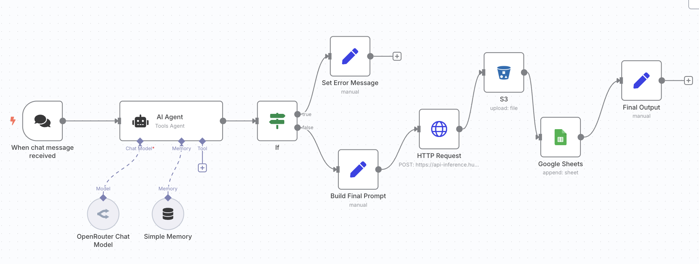
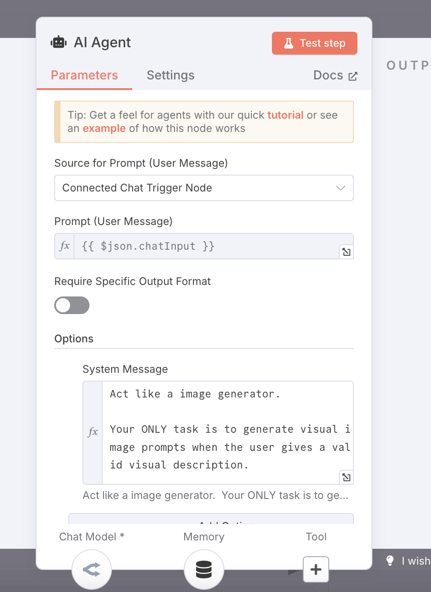

# Chat-AI-Agent-Text-to-Image-Convertor

# 🎨 DreamWeaver AI (n8n + OpenRouter + Hugging Face + Cloud Storage + Google Sheets)
An intelligent AI Image Generator built using n8n, OpenRouter API, Hugging Face (Stable Diffusion XL), Cloudflare R2 storage, and Google Sheets.
This system takes text prompts from users, generates high-quality images, and logs everything — securely and automatically. 🚀🖼️

## 🔧 Tech Stack
🤖 AI Agent: OpenRouter API

🎛️ Workflow Automation: n8n (self-hosted)

🎨 Image Generation Model: Hugging Face (Stable Diffusion XL)

☁️ Cloud Storage: Cloudflare R2 (S3-compatible)

## System Architecture

# 📊 Data Logging: Google Sheets

# 🖥️ Presentation: Prezi Interactive Presentation
https://prezi.com/view/A7Imv7mCvR6HrUwFmItS/ 

## 🚀 Features
✅ Prompt Validation: Only processes valid visual prompts

✅ Prompt Enhancement: Adds styles like "hyperrealistic, soft lighting" automatically

✅ AI Image Generation: Powered by Stable Diffusion XL

✅ Cloud Storage Upload: Images saved securely to S3-compatible storage

✅ Google Sheets Logging: Saves prompt + image URL for traceability

✅ Error Handling: Friendly messages for invalid prompts

✅ Fully Modular Design: Easy to expand or integrate

## 🧠 How It Works
✅ User Input: User types a prompt into n8n chat agent.

✅ Prompt Validation: AI Agent checks if the prompt is visual.

✅ Prompt Enhancement: Raw prompt is transformed to improve image quality.

✅ API Call: Enhanced prompt sent to Hugging Face to generate an image.

✅ Cloud Upload: Generated image uploaded to Cloudflare R2.

✅ Google Sheets Logging: Final prompt and image URL logged automatically.

✅ Output: User receives a direct link to their AI-generated image.

## 📈 Performance Metrics

## Metric	                          Value
Average Image Generation	      ~6–8 seconds
S3 Upload Time	                  ~1–2 seconds
Google Sheets Logging	            ~1 second
End-to-End Workflow Completion	~10–12 seconds

## 📄 Key Nodes Summary
### 🔧 AI Agent Node:
Validates user input and ensures only visual prompts are processed.

### 🎨 Build Final Prompt Node:
Enhances raw prompts into rich, artistic styles automatically.

### 🌐 HTTP Request Node:
Sends prompts to Hugging Face for image generation.

### 📦 S3 Node:
Uploads generated images with dynamic timestamped filenames.

### 📊 Google Sheets Node:
Logs prompt and public image URL for future access and analysis.

## 🧠 Prompt Engineering Strategies
✅ System role-enforcement: AI acts only as an image generator.

✅ Fallback messaging for invalid prompts.

✅ Style augmentation ("hyperrealistic style with warm lighting") for better images.

## 🧠 Lessons Learned
Mastered building modular low-code AI workflows with n8n.

Improved understanding of prompt engineering impacts on outputs.

Implemented secure, authenticated API interactions.

Developed strong ethical AI deployment practices.

## 🚧 System Limitations & Improvements

✅ Limitation	                       
No manual style selection

Rating Collection	 

Analytics Dashboard                  
                                        
✅ Future Improvement
Add image style presets for users

Ask the user to rate the output (1–5 stars) to collect valuable training signals

Develop a visual dashboard (via Looker Studio or Google Sheets Charts) to track prompts trends, styles used, and average ratings

## 📝 Author
Thivya Dhanasegaran
